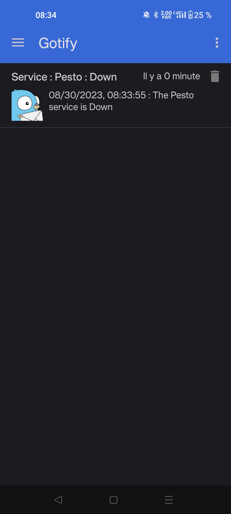
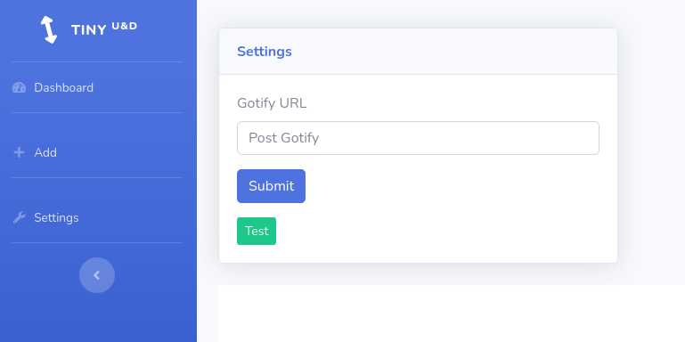
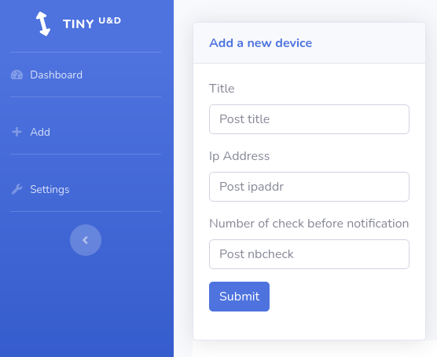

<p align="center">
  
</p>

# tinyud

Tiny Up & Down is a simple python program that alerts you via Gotify when a host is unavailable.
<p align="center">
  
</p>

## Installation

### Docker compose
```
  tinyud:
    image: geoholz/tinyud
    ports:
      - 8765:8765
    volumes:
        - ./tinyud:/app/db
```

## Configuration

### First, you need to specify your Gotify address and token in the database via settings page :
<p align="center">
  
</p>

### Then add your services to be monitored one by one :
<p align="center">
  
</p>


## Contributing

Pull requests are welcome. For major changes, please open an issue first
to discuss what you would like to change.

Please make sure to update tests as appropriate.

## License

[MIT](https://choosealicense.com/licenses/mit/)